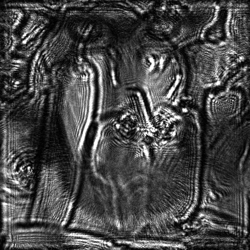
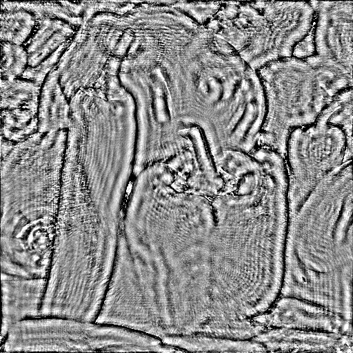

# Inline Holographic Reconstruction
Python implementation of angular spectrum and multi-height phase recovery algorithms to reconstruct digital in-line holograms.

## What's inside?
This package includes solvers for the holographic reconstruction problem. Computations can be performed on both cpu and gpu. The gpu-accelerated version is programmed on tensorflow and is auto-gradient friendly, thus can be easily employed on machine learning models.

## Installation
To install the package, run:
```
pythom -m pip install fringe
```
The example files are not included in the package. To import them, clone the repository. In the git bash, run:
```
$ git clone https://github.com/farhadnkm/Fringe.Py
```

## How to use
1. Import

Images must be ndarrays or tensors. A simple i/o functionality for this purpose is integrated inside the package:
```
from fringe.utils.io import import_image, import_image_seq, export_image
from fringe.utils.modifiers import ImageToArray, PreprocessHologram, ConvertToTensor
```
*Modifiers* are preprocessing classes. These classes have a *process* method which is called by the import functions on any image import and returns the processed image.
```
image_path = 'IMAGE_PATH.tif'
background_path = 'BACKGROUND_PATH.tif'

p1 = ImageToArray(bit_depth=16, channel='gray', crop_window=None, dtype='float32')
bg = import_image(background_path, preprocessor=p1)
p2 = PreprocessHologram(background=bg)

hologram = import_image(background_path, preprocessor=[p1, p2])
```
2. Reconstruct

*Solvers* are reconstruction algorithms having a *solve* function. *solve* functions give hologram(s) and axial distance(s) as input parameters and return a complex-valued reconstructed image.
```
solver = AsSolver(shape=h.shape, dx=1.12, dy=1.12, wavelength=532e-3)
z = -300

amp = np.abs(solver.solve(hologram, z))
phase = unwrap_phase(np.angle(solver.solve(hologram, z)))
```

3. Export
```
export_image(amp, os.path.join('PATH', 'amplitude.png'), dtype='uint8')
export_image(phase, os.path.join('PATH', 'phase.png'), dtype='uint8')
```
Examples for multi-height phase recovery and gpu processing are included in the example notebooks.

## Outcomes

A Hologram:



Reconstructed Amplitude and phase images obtained by back propagation:

 

Reconstructed Amplitude and phase images obtained by MHPR method using 8 axially displaced holograms:

 
