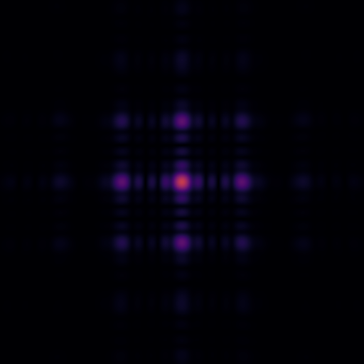

# Fringe.Py

A coherent propagation and diffraction simulation tool, all written in Python. 

In this package, a set of utilities are provided to simulate coherent signal propagation. It is particularly made for free-space optical propagation, diffraction, and holography. However, the tools are compatible with 1D and 2D data structures and can be potentially used for any sort of spatially-coherent signals.

-----

<p align="center">
    
<p>

    
## What's inside?

A set of modules are provided to solve the scalar diffraction problem. The codes are GPU-friendly, compatible with well-known computation libraries (Numpy, TensorFlow) and they support batch processing. Using the TensorFlow backend, computations become autograd-compatible and could be mounted on machine learning models. Angular spectrum algorithm is the primary work horse for field propagation though other custom solvers could be used. Aside the built-in Numpy and TensorFlow backends, any computational means could be employed to process tensor operations.

It also includes:
- a simple yet useful data pipeline to load and standardize data. For now, it only supports images.
- Gerchberg-Saxton multi-distance phase recovery algorithm. It can be easily tweaked to support other variations of signal e.g. by wavelength.

## Installation
To install the package, run:
```
python -m pip install fringe
```
Fringe requires ```numpy```, ```tensorflow 2.x```, and ```scikit_image```.
The example files are not included in the package and should be downloaded separately. Also they require ```matplotlib``` to show plots.

## How to Use
1. Import or create data

For images:
```
import numpy as np
from fringe.utils.io import import_image
from fringe.utils.modifiers import ImageToArray, Normalize, MakeComplex
```
Images need to be standardized, normalized, and casted to complex data type. *Modifiers* are tools made for this purpose which apply these operations on import.
```
p1 = ImageToArray(bit_depth=16, channel='gray', crop_window=None, dtype='float32')
p2 = Normalize(background=np.ones((512, 512)))
p3 = MakeComplex(set_as='amplitude', phase=0)

obj = import_image("images/squares.png", preprocessor=[p1, p2, p3])
```
2. Propagate

*Solvers* contain propagation algorithms and can be called by *solver.solve*. In particular, angular Spectrum algorithm convolves the input field with a free-space propagtor function which depends on *wavelength λ* (or *wavenumber k=2π/λ*) and distance *z*.
```
from numpy import pi, abs, angle
from fringe.solvers.AngularSpectrum import AngularSpectrumSolver as AsSolver

solver = AsSolver(shape=obj.shape, dr=1, is_batched=False, padding="same", pad_fill_value=0, backend="Numpy")
rec = solver.solve(hologram, k=2*pi/500e-3, z=-1000)
amp, phase = abs(rec), angle(rec)

ax = pyplot.sublots(2, 1, 1)
ax[0].imshow(abs(obj))
ax[1].imshow(amp)
pyplot.show()
```

<p align="center">
     
<p>

Example notebooks provide further details with 1D and 2D diffraction, GPU acceleration, batch processing, and phase recovery.

##License

Fringe is released under the MIT license. See LICENSE for details.
