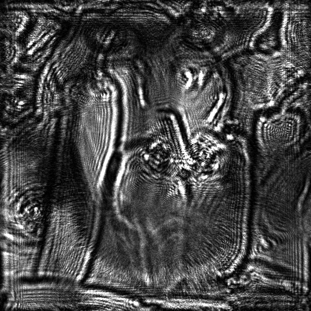
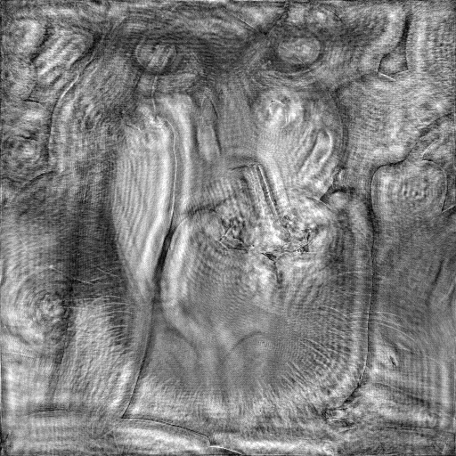
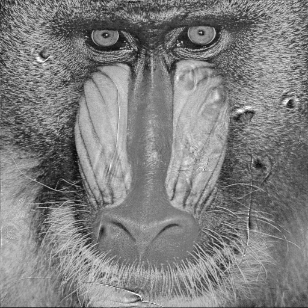

# Inline Holographic Reconstruction
Python implementation of Inline holographic reconstruction using the angular spectrum method.

## What's inside?
This package includes forward reconstruction of holograms, simulation of holograms using two images as phase and amplitude, and the multi-height phase recovery (MHPR) algorithm to retrieve full object information using a sequence of holograms.

Computations could be performed using two frameworks:
1. Numpy which is suitable for typical applications.
2. Tensorflow which enables GPU or TPU accelerated processing. 

Tensorflow also allows embodying the framework in machine learning models.

## Outcomes

A Hologram:

Reconstructed Amplitude and phase images by back propagation:

 

Reconstructed Amplitude and phase images using MHPR method applied on 8 axially displaced holograms:

 
